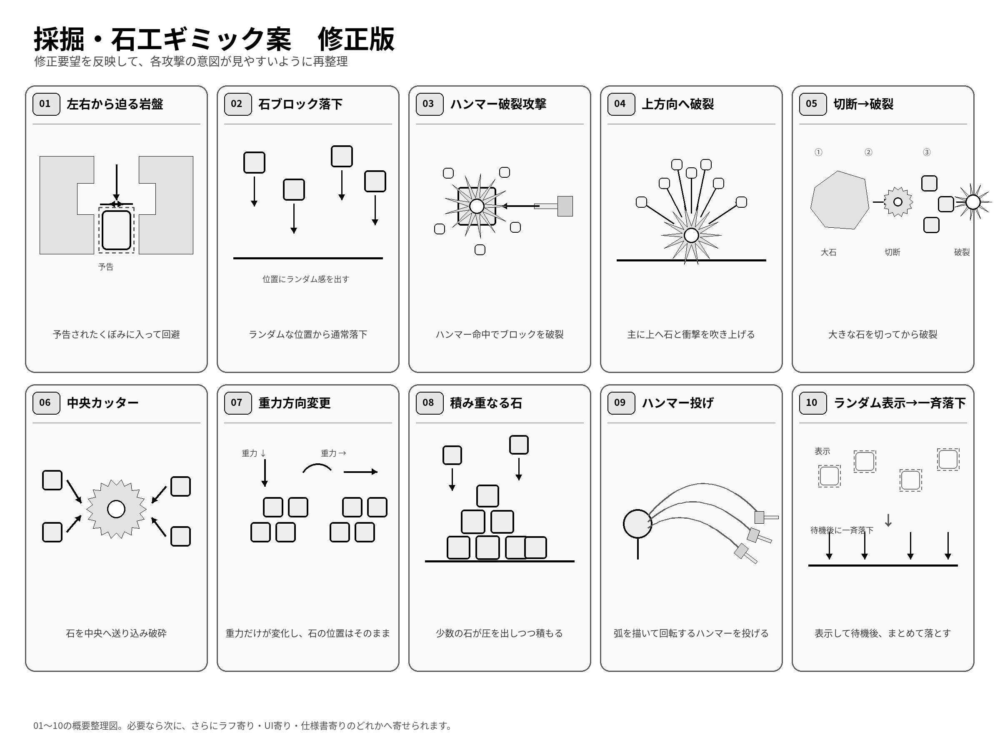

# 採掘・石工ギミック案まとめ

手書きメモをもとに、ギミック案を整理したメモです。  
Claude向けの実装指示書ではなく、内容整理用のまとめとして使う想定です。

---

## 01. 左右から押し込む岩盤

- 岩盤が左右から迫ってくる攻撃
- プレイヤーは、岩盤の特定のへこみ位置へ移動しないと回避できない
- 安全地帯となるへこみ位置は事前に予告表示する
- 予告は、影・マーカー・点線・発光などで分かりやすく示す

### イメージ
- 壁全体が閉じてくる
- 一部だけ避難できるくぼみがある
- その場所へ素早く移動してやり過ごす

---

## 02. 石ブロック落下攻撃

### 基本パターン
- 石ブロックが上から落下する
- 地面や他の石の上でしっかり積み重なる
- 重さや物理感があり、積み上がっていく感じを出す

### バリエーション
- 落下前に、複数の石をランダムな位置へ表示する
- この時点ではまだ落ちてこない
- 少し待ってから、表示されていた石が一気に落下する
- 予告表示と本落下の二段構成にする

### ポイント
- 予告で位置を見せる
- その後まとめて落とす
- ランダム配置だが、回避不能になりすぎないよう調整する

---

## 03. ハンマーでブロックを破裂させる攻撃

- ハンマーがブロックに当たる
- 命中したブロックが破裂する
- 破裂時に破片や衝撃が発生する攻撃

### イメージ
- 単なる固定や食い込みではなく、破壊が主目的
- 破裂時に周囲へ破片が散る
- 近くにいると二次被害がある構成も考えられる

---

## 04. 爆発で石を広く吹き飛ばす攻撃

- 地面の下や石の周辺から爆発が起きる
- 真上へ飛ばすだけではなく、周囲にも広がるように吹き飛ばす
- 爆発らしい広がりを持たせる

### ポイント
- 上方向だけでなく、斜めや横方向にも力が加わる
- 中心から外側へ散る見た目にする
- 爆風の広がりが分かる表現にする

---

## 05. デカい石をカッターで切り刻んでから破裂させる攻撃

- 大きな石が対象
- まずカッターで石を切り刻む
- その後、細かくなった石や本体を破裂させて攻撃する

### 流れ
1. 大きな石が出現する
2. カッターで切断する
3. 分割・細断された状態になる
4. その後に破裂して危険範囲を作る

### ポイント
- 切る工程と破裂工程を分ける
- 攻撃が段階的に見えるようにする
- 破裂前に少し間を置くと分かりやすい

---

## 06. 中央カッター

- 中央に固定されたカッター
- 石が流れ込むと破壊する
- 基本方針はそのままでよい

### 補足
- 図にしたとき、矢印の向きは自然に見えるように調整したい
- 石がカッターへ吸い込まれる、または送り込まれる流れを素直に見せる

---

## 07. 重力方向を変えて石を動かす攻撃

- 02の続きとなる攻撃パターンのひとつ
- 石を落とすだけでなく、重力の向きを変えて動かす
- これにより、石が横や斜めにも流れる

### イメージ
- 通常の下向き重力から、左・右・上方向などへ切り替える
- 積まれていた石が崩れたり、流れたりする
- プレイヤーは石の移動方向を見て回避する

### ポイント
- 予告があると分かりやすい
- 重力変更後に石が自然に崩れるようにしたい
- 攻撃として使うなら、向き変更のタイミングが重要

---

## 08. 積み重なった石による攻撃・圧迫感

- これも02の流れを汲む攻撃案
- 石がしっかり積み重なっている感じを大事にする
- 単発で落ちるだけでなく、積もって圧迫する印象を出したい

### イメージ
- 次々に石が落ち、山のように積まれる
- 足場が埋まる
- 通路が狭くなる
- 押しつぶされそうな圧が出る

### ポイント
- 石同士の接触や段差が自然に見えること
- 乱雑でも、ちゃんと重なっているように見えること
- 落下後の残り方にも存在感を持たせる

---

## 09. ハンマーブロス風にハンマーを投げる攻撃

- ハンマーブロスのように、ハンマーを投げる攻撃
- その場で回転する障害物ではなく、投射攻撃として扱う

### イメージ
- ハンマーが弧を描いて飛ぶ
- 回転しながら飛来する
- 複数連投したり、高低差をつけたりできる

### ポイント
- 投げた瞬間が分かるモーションや予告があると見やすい
- 飛び道具としての軌道が重要
- 回転しながら飛ぶことで危険物らしさを出す

---

## 10. 02のバリエーションへ置き換え

- もともとの案10は使わず、02で述べたバリエーションへ置き換える
- つまり、独立した別攻撃としての10ではなく、02の派生として整理する

### 置き換え内容
- ランダムに石を表示する
- その時点では落ちてこない
- 少し待ってから一気に落とす

---

## 全体メモ

- 02・07・08・10は、落石や石の制御を軸にした連続系の攻撃としてまとめて考えられる
- 03・04・05は、石を破壊・破裂させる系統の攻撃として相性がよい
- 01は回避重視のギミック
- 06は処理装置系
- 09は飛び道具系の攻撃

---

## 簡易分類

### 回避ギミック
- 01 左右から押し込む岩盤

### 落石・重力操作系
- 02 石ブロック落下攻撃
- 07 重力方向を変えて石を動かす攻撃
- 08 積み重なった石による攻撃・圧迫感
- 10 02のバリエーションへ置き換え

### 破壊・爆発系
- 03 ハンマーでブロックを破裂させる攻撃
- 04 爆発で石を広く吹き飛ばす攻撃
- 05 デカい石をカッターで切り刻んでから破裂させる攻撃

### 装置系
- 06 中央カッター

### 投射攻撃系
- 09 ハンマーブロス風にハンマーを投げる攻撃